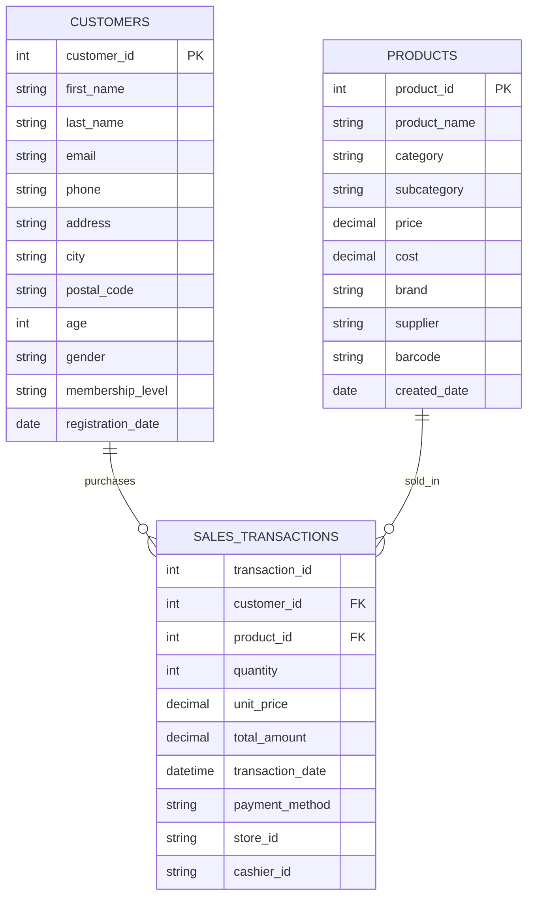

## はじめに

このチュートリアルはすべてDocker環境で行うためローカル環境を汚染しません。
最初のベースとなるファイルのみレポジトリに配置されているので、それらをどんどんとdbtを操作していくのがこのチュートリアルの基本的な流れとなっています。

また、dbtに用いるOLAPDBとしてDuckDBを使用しています。
今回はDuckDBの中身まで言及はしませんが、SQLiteのOLAPDB版とざっくり捉えていただいて構いません。
SQLiteのようにサーバを立ち上げなくてもファイルベースで管理できるとても優れたDBです。
wasmで実装されたWebGUIがあるなど、とてもイケているDBなので興味があったら深ぼっていただいても良いかもしれません。私はSnowflakeとDuckDBのハイブリット構成でコスト最適化ができないか日々考えています。

まずは下記のレポジトリよりDockerfileおよびSeedファイルをCloneしてきましょう。

```bash
git clone https://github.com/yo4raw/dbt-tutorial
cd dbt-tutorial
```

Dockerfileとcompose.ymlはよくありがちな構成なので特に解説はしませんが、ご確認いただきたいのはseedsの中にある4ファイルです。

今回seedデータとして準備した3ファイルと、それらの内容を記載したschema.ymlの4つで構成されています。



この構造をまずは把握していただいたうえで早速チュートリアルに入っていきましょう！

下記のコマンドでDockerを立ち上げてsshでDockerの中に入りましょう。

```bash
docker compose up -d
docker compose exec dbt-tutorial /bin/bash
```
